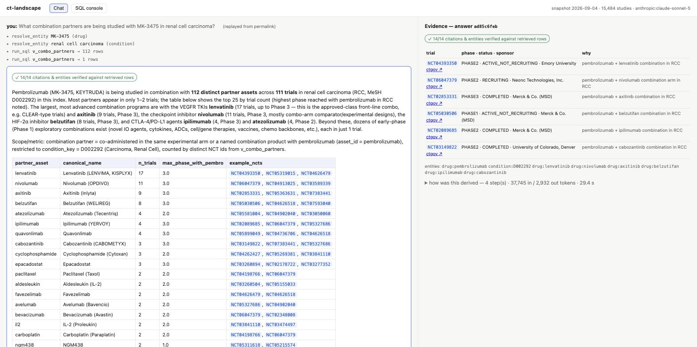
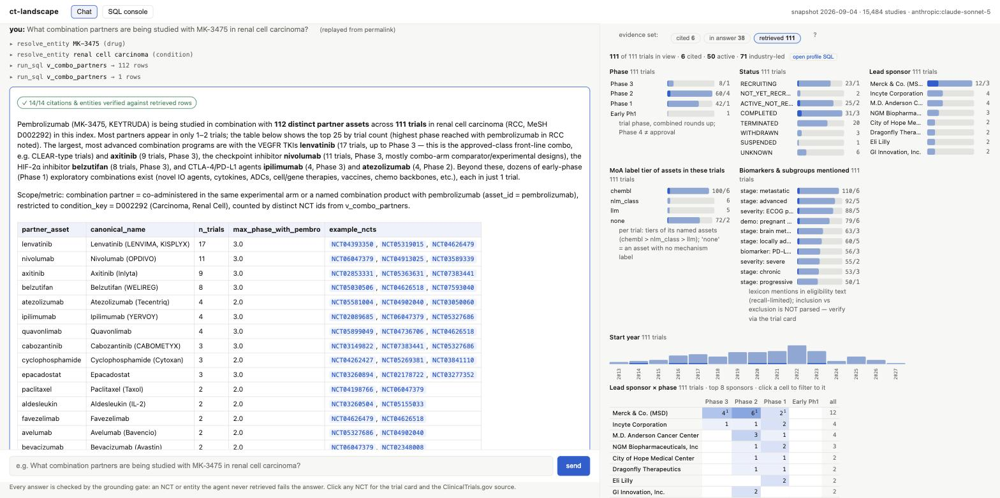
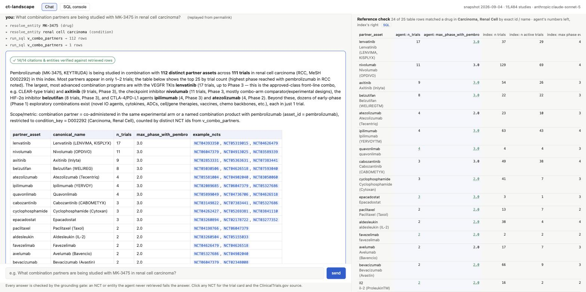

# ct-landscape

A ClinicalTrials.gov landscape-question agent: **one DuckDB index**, a **small tool-using agent** (Pydantic AI, three read-only tools), and a **chat UI whose every answer is machine-verified and traceable** to the trials that support it.

Brief: `argon-brief.md` · Design specification: `ct-landscape-agent-design.md` · Build log / resumable checklist: `TASKS.md` · How AI coding agents were used: `PROMPTS.md`.

**Where each deliverable in the brief lives:** source + run instructions → [5-minute reviewer path](#5-minute-reviewer-path) · agent / query interface → the chat UI (`ctl serve`) and `ctl sql`, [What it answers](#what-it-answers-and-how) · example questions and answers → [Example landscape questions](#example-landscape-questions-zero-llm-spend--straight-from-the-views) and the [UI walkthrough](#the-chat-ui-on-the-specs-worked-example) · indexing / ontology architecture, where it performs well and poorly → [Architecture](#architecture) and [Where it performs well, where it performs poorly](#where-it-performs-well-where-it-performs-poorly) · precision/recall tradeoffs → [the dials](#precision--recall-tradeoffs-the-dials) · evaluation results and failure modes → [Evaluation](#evaluation) · use of coding agents → [How AI coding agents were used](#how-ai-coding-agents-were-used) and `PROMPTS.md`.

---

## 5-minute reviewer path

```bash
uv sync                                    # Python 3.12 + deps (uv creates .venv)
uv run pytest                              # ~230 offline tests: hand-built records, the shipped mini.zip, scripted agents — no network, no LLM
uv run ctl build --demo                    # ~1 min: data/fixtures/demo.zip (15,484 studies) → data/ctg_demo.duckdb (raw → entities → views → funnel)
cp .env.example .env                       # set ANTHROPIC_API_KEY=… for live chat
uv run ctl serve --demo                    # http://127.0.0.1:8000
```

The demo slice ships in-repo and holds **every** trial for the gold-set indications (Erdheim-Chester disease, geographic atrophy, multiple myeloma, IPF, NSCLC, renal cell carcinoma) plus a random sample, so gold questions are complete within it by construction; every corpus-level number below comes from the full build.

**Works without an API key:** `ctl build`, `ctl sql`, the SQL-console tab, trial cards, permalinked recorded answers, `ctl eval --mode replay`, the whole test suite. **Needs a key:** live chat, `ctl eval --mode live`, `ctl enrich llm` (the optional LLM mechanism tier).

### Full build

```bash
uv run ctl fetch          # 2.74 GB, 601,694 per-study JSON files (the site's empty-search "Download → JSON" zip; the documented v2 pager is the --pager fallback)
uv run ctl build          # 70 s ingest + ~6 min normalize on 13 cores → data/ctg.duckdb; prints the census + funnel
uv run ctl enrich chembl  # optional: re-derive the ChEMBL mechanism tier live (the shipped JSONL is loaded by `ctl build` at $0)
uv run ctl serve
```

`ctl` is the ops surface (`fetch / build / enrich / serve / eval / sql`); the product interface is the web app.

---

## What it answers, and how

| # | Question archetype | Definition of record (a named SQL view) |
|---|---|---|
| Q1 | Drugs in development for indication X | `v_programs` — one row per (asset, condition): trials, active trials, max phase ever / active, full NCT list |
| Q2 | Most advanced programs in X | `v_programs.max_phase_active` (trial-derived, capped at Phase 3 semantically — never an approval claim) |
| Q3 | Most active companies in area Y | `v_sponsor_activity` — lead sponsor × therapeutic area; industry-only, ranked by active trials by default |
| Q4 | MoA / targets under investigation in X | `v_moa` (provenance-labeled waterfall: `chembl` > `curated` > `nlm_class` > `llm`) ⋈ `v_programs` |
| Q5 | Trials studying mechanism M | `v_moa_trials` — mechanism key → assets → trials, by condition |
| Q6 | Biomarkers / patient subgroups targeted | `v_population_landscape` — typed lexicon mentions (biomarker · demographic · severity · prior therapy · line · stage) |
| Q7 | Combination partners of asset / mechanism Z | `v_combo_partners` — co-administration in one experimental arm (`arm`) or a combination-named product (`name`); pairs that are both present in every arm (the backbone) are excluded, same-mechanism pairs are flagged |

The agent has exactly three tools — `resolve_entity` (a deterministic ladder, never fuzzy), `run_sql` (a four-layer read-only sandbox over these views), `get_trial` (one trial card) — and one way to finish: the `submit_answer` structured output. A **fail-closed grounding gate** runs as the output validator: every NCT id and every entity in the answer must have appeared in a tool result during the conversation, or the answer is rejected and the model gets one retry. The UI shows the gate's verdict as a badge the model cannot forge, renders citations with phase/status/sponsor pulled live from the index, links every NCT to its trial card and to clinicaltrials.gov, and exposes the full derivation trace (every SQL statement, row counts, timings) behind a permalink.

Anti-goals, deliberately: no embeddings, no BM25, no graph database, no frontend build chain, no orchestration framework beyond Pydantic AI's typed primitives. Landscape questions are aggregations over a clean index, not lookups over prose.

---

## Architecture

```
ctg-studies.json.zip ─ fetch → ingest ──raw tables (verbatim, all 601,694 studies)──→ normalize/ ──entity + edge tables──→ enrich/ ──MoA tiers──┐
                                   census                                     census (per-gate drop counts)              census (join)          │
                                                     ctg.duckdb  ←──────────────────── views.sql (every metric defined once) ←────────────────┘
                                                          │
                              agent/: Pydantic AI Agent — resolve_entity · run_sql · get_trial → submit_answer(Answer) → output_validator = grounding gate
                                                          │
                              api/: FastAPI — POST ask (SSE) · answers (permalink) · trials · entities/resolve · sql · meta;   web/: one static page
                                                          │
                              evals/: gold.yaml → harness → FLOOR / OBJ / DIAG report (+ offline replay gate, mutation suite)
```

### The ontology: a relational star schema + controlled vocabularies + definition-of-record views

Three strictly ordered layers; scope filters (interventional, industry, drug/biologic) live **only** in the views, so every scoping decision is reversible and countable.

1. **Raw** (`ingest.py`): the dump verbatim — `studies`, `study_conditions`, `interventions`, `intervention_other_names`, `arms`, `arm_interventions`, `sponsors`, `mesh_terms` (condition and intervention MeSH leaves **and** ancestors). The only derived columns are single-field pure functions: `phase_norm` (combined phases round up) and month-padded `*_parsed` dates with a precision flag. `snapshot_date` is the max last-update date **in the data**, never the wall clock.
2. **Entities and edges** (`normalize/`, deterministic, zero LLM calls):
   - **Assets.** Intervention names → registry-specific cleaning → **whole-label noise gates** (placebo/sham/vehicle, standard-of-care, class labels such as "corticosteroids" or "PD-1", metadata cues; every rejection counted by gate) → a **dedup-key router** that picks one of three key shapes: combination names split on `/ + and with` (components kept as edges), biologic-shaped names keep their Greek qualifier and biosimilar suffix (epoetin alfa ≠ epoetin beta; trastuzumab ≠ trastuzumab-dkst), everything else runs a fixed-point loop of salt / dose-form / device / edge-qualifier strips with an electrolyte guard ("potassium chloride" stays whole). The regimen split ("lenalidomide dexamethasone" → two known single-token assets) runs only after the salt / dose-form / device strips and never accepts a form word as a member, so "abiraterone acetate" and "nicotine gum" stay one drug. Then `otherNames` — the trial itself saying "MK-3475 = pembrolizumab = KEYTRUDA" — merge clusters through a union-find with three guards: an alias claimed by several clusters is **vetoed** unless one claimant dominates (≥5 trials and ≥10× every other); uniting two existing clusters needs the alias asserted in ≥2 trials (one trial's `otherNames` often enumerate alternatives); and on an intervention listing ≥4 `otherNames`, a name no other trial asserts attaches only when it is code-shaped or token-related to the intervention (pasted product lists). Every decision is written to `contested_aliases` with its resolution. A small curated synonym file (`lexicons/asset_synonyms.yaml`, ~45 INN ⟷ code ⟷ brand groups for the eval indications) is applied before the `otherNames` pass so a fixture with one trial per name still unifies BI 1015550 with nerandomilast; registry evidence always keeps the provenance label. No fuzzy matching anywhere.
   - **Arm roles.** From `armGroups[]` + `armGroupLabels`: an asset is `subject` if it sits in any EXPERIMENTAL arm, `comparator` if only in comparator-type arms, else `unknown` (OTHER-typed arms, arm-less records) — three-valued and retained, never read as False. `in_all_arms` (the background-therapy signal) is defined only on ≥2-arm trials.
   - **Conditions.** Two surfaces share one key column: MeSH leaf ids from the dump (`mesh_leaf`) and an order-preserving fold of the listed strings (`listed`), with a denoise census (healthy volunteers, quality-of-life-only, biomarker-only, device-only). Counting views read **one surface per trial** (`v_trial_conditions_primary`), so a trial listing "NSCLC" and carrying D002289 is counted once. MeSH ancestors are quarantined to rollups: a static heading → therapeutic-area table with first-present-wins priority, and an explicit `Unclassified` bucket for listed-only conditions. A child condition is never rewritten to its parent.
   - **Companies.** Suffix-pop normalisation (legal forms, industry words), ~30 curated alias groups with dated acquisitions (Celgene → BMS 2019, Seagen → Pfizer 2023 …), and the registry's own self-declared parents ("Genzyme, a Sanofi Company"). Never substring containment. `agency_class` is kept verbatim; lead vs collaborator stay distinct roles; ownership is a disclosed limitation, with `v_asset_sponsors.originator_proxy` (earliest industry lead) as a queryable proxy.
   - **Populations.** A typed lexicon (`lexicons/populations.yaml`, ~250 entries) over title + conditions + eligibility: biomarkers and five subgroup kinds, each mention stored with its evidence line. Inclusion vs exclusion is not parsed (v1 limitation, stated in the agent's system prompt).
3. **Views** (`views.sql`): every landscape metric defined exactly once, with no enumeration caps (`v_programs.nct_ids` is the full list). The build fails if any view is empty.

**Mechanism waterfall** (`enrich/`, provenance-labeled, nothing overwrites a higher tier): (1) **ChEMBL** curated mechanisms + gene-symbol targets (CC BY-SA 3.0, EMBL-EBI; the derived `data/enrichment/chembl_moa.jsonl` ships in-repo, share-alike), joined by **exact** fold of our aliases against ChEMBL names and vetoed only on mechanism ambiguity — ChEMBL never merges or creates assets; (2) a **curated tier** (`lexicons/curated_moa.yaml`): hand-written, cited, gene-level mechanisms for ~35 pipeline assets that ChEMBL and NLM do not carry yet (the IPF PDE4B / αvβ6 integrin / LPA1 agents, the KRAS G12C class, the geographic-atrophy complement agents, the myeloma bispecifics and CAR-Ts), resolved by alias at load so one file serves every index; (3) the dump's own NLM pharmacologic classes (`interventionBrowseModule.ancestors`), attached only when the intervention MeSH leaf keys to the asset's own alias; (4) an abstain-first **LLM tier** (Haiku 4.5 via the Batches API, $35 hard ceiling, append-only checkpoint, `refusal` = settled abstain) for the code-named tail — piloted on 300 assets (shipped; see Evaluation), bulk pass deliberately not run.

### Choices the brief left open, and why

| Decision | Rejected alternative | Why |
|---|---|---|
| DuckDB, one file, in-process, read-only at serve time | Postgres (ops burden), SQLite (weak aggregations) | analytical joins + GROUP BY over millions of rows, zero setup, sandboxable connections |
| Star schema + vocabularies + definition-of-record views as the "ontology" | graph DB, embeddings | every archetype is a 1–2-hop join; metrics defined once; SQL is what an LLM writes reliably |
| Raw layer keeps all 601k studies; scope in views | scope at ingest | reversible, auditable, countable |
| Drug identity from the registry's own structure (otherNames + arm tables) with a contested-alias veto + dominance rule | fuzzy matching; RxNorm/PubChem/LLM cascades | single-source corpus; fuzzy matching is the largest over-merge risk per line of code |
| Conditions: in-dump MeSH leaves + folded strings; ancestors only for rollups | UMLS/ICD crosswalks; LLM disease resolution | license-free, offline; ancestors in precise gates manufacture false positives |
| Three-valued arm roles | binary comparator flag | single-arm trials label everything OTHER; absence is not evidence of comparator |
| ChEMBL as lookup, never as alias evidence | ChEMBL synonyms feeding merges | external alias accretion into a global namespace is where cross-source over-merges come from |
| Agent-written SQL over documented views, in a four-layer sandbox | a fixed per-question tool catalogue | open question space; the schema card + gate + FLOOR evals carry the risk |
| Fail-closed grounding gate at the output boundary, on NCTs **and** entities | fail-open | evidence is a fully observed local index; "exists in the index" is not "was retrieved" |
| Answers persisted to JSON files | writing answers into DuckDB | the DB stays pristine and single-writer; the answer store doubles as replay fixtures |

---

## Completeness funnel (emitted by `ctl build` on the full corpus, snapshot 2026-09-04)

```
601,694 studies ingested (= 601,694 zip members; 0 parse failures)
  → 459,233 interventional → 225,018 drug/bio interventional → 132,164 industry-lead → 90,304 in scope (industry ∩ interventional ∩ drug/bio)
interventions: 470,008 drug/bio names → −76,013 gated {placebo/sham prefix 42,191 · exact noise 11,203 · class/procedure regex 9,204 ·
               placebo remnant 3,879 · too long 3,741 · metadata cue 2,015 · either/or arms 1,317 · qualifiers-only 531 · …}
  → 393,995 keyed (83.8%) → 81,128 assets + 18,695 combination assets; 3,447 merged via otherNames (16,908 single-trial
    merges blocked; 2,740 single-trial names on long otherNames lists not attached); 87 curated synonym merges;
    936 aliases assigned by dominance; 10,065 contested aliases vetoed (logged, never applied)
  → 41,277 in-scope assets → mechanism-labeled: chembl 7,286 · curated 36 · nlm_class 1,260 · llm 267 (pilot; 28 abstained)
    → 14.7% of in-scope assets carry ≥1 mechanism label = 56.2% of in-scope trial×asset rows (the head of the distribution)
conditions: 78.9% of trials carry ≥1 MeSH leaf; 108,071 listed-only (→ area "Unclassified", never dropped);
            denoise drops {healthy volunteers 18,075 · device/procedure 14,332 · behaviour/QoL 13,796 · biomarker-only 2,810 · too short 307}
arms: 92.3% of drug trials have arms; 87.2% of (trial, asset) roles decidable {subject 277,466 · comparator 65,947 · unknown 50,582}
populations: % of trials with ≥1 typed mention — demographic 57.6 · disease stage 49.5 · severity 38.2 · biomarker 14.0 · line of therapy 8.8 · prior therapy 7.1
```

Every number is a claim the eval can audit; the UI's coverage footer restates the load-bearing ones on every answer, and MoA answers additionally state their own labeled fraction ("N of M in-scope assets for this indication carry a mechanism label", computed by SQL).

---

## The chat UI on the spec's worked example



Left: the derivation timeline (`resolve_entity` MK-3475 → pembrolizumab; `run_sql` over `v_combo_partners`), the machine-verified gate badge, and the structured table with every NCT auto-linked. Right: the citations with phase, status and sponsor pulled live from the index, the entity list, and the expandable trace (each SQL statement, row counts, timings, coverage footer). Answered in 4 model turns, ~30 s, with prompt caching.


The same conversation one turn later. "Of those partners" resolves against the previous turn's retrieved rows (the answer's footer says `context includes turns 1–1`); the timeline shows the agent's first SQL failing on a column the view does not have and the corrected query succeeding — errors are tool results, not retries — then six `get_trial` cards feeding a table whose sponsor column separates industry leads (Merck, Eisai) from cooperative groups (Alliance, SWOG). The caveats state the house definition of "active", that sponsor ≠ owner, and that absence in this snapshot is not absence everywhere. 8 steps, 31 s, gate 17/17.

### The evidence dashboard: inspecting what the agent saw, not just what it said





Every answer has three nested evidence sets: **cited** (`citations[]`), **in answer** (every NCT in the prose or table) and **retrieved** (every NCT that appeared in any tool result this conversation, i.e. the grounding gate's set). The right-hand panel profiles the chosen set straight from the index (`POST /api/trials/profile`), never from model text: phase, status, lead sponsor, start year, the MoA-label tier of the assets in each trial, and the **biomarkers and patient subgroups** its eligibility text mentions (lexicon-based, so recall-limited, and inclusion vs exclusion is not parsed — the chart says so), with the cited trials drawn as the darker segment of every bar. A **lead sponsor × phase matrix** sits under the bars; a cell sets both filters at once. Bars and cells cross-filter each other and the trial list, so "what did the agent see but not cite?" and "which of these are Phase 3 and recruiting?" are one click, with no model in the loop.

Three more figures close the loop between the answer and the index:

- **The answer table as a figure.** A ranked table with a numeric column is drawn as a bar chart from `table.rows` (never parsed from prose). Clicking a bar highlights the row and filters the evidence to the row's listed NCTs plus every evidence-set trial naming an asset whose id equals a cell verbatim. When that count differs from the row's own number (18 trials name lenvatinib; 17 pair it with pembrolizumab in one arm), the difference is a real difference in definition, shown rather than hidden.
- **Reference check: the agent's table against the definition of record.** For each condition / drug / company the answer named, the index returns its definition-of-record rows (`v_programs` per asset for a condition, per condition for a drug; `v_sponsor_condition` for a company) keyed by exact id and exact canonical name. Every answer-table row whose cell equals a key verbatim gets the index's numbers laid beside the agent's (trials, active trials, max phase ever / active, lead company of the most advanced trial). A like-kind equality is underlined; a difference is shown, not judged — on the RCC combination question the agent's 17 lenvatinib trials are arm-level pairings with pembrolizumab, the index's 37 are every lenvatinib program trial in RCC, and both are correct under their own column header. No fuzzy matching: unmatched rows are omitted and counted.
- **Entity landscapes.** The same cards also show headline counts, programs by most-advanced active phase, most active lead sponsors, MoA-label coverage by tier (the completeness the §7.3 house rule asks the agent to state), biomarkers and subgroups, trials by start year, and a sponsor × phase (or condition × phase) matrix. Each figure carries a **SQL** button that drops its exact query into the SQL console, so a reviewer can re-run any number on the screen.

The coverage footer in the trace panel is drawn the same way, so an answer's completeness claims sit next to the index's own completeness.

## Example landscape questions (zero LLM spend — straight from the views)

These are the queries the agent writes; the chat UI adds the prose, the gate, and the evidence panel.

**Q1/Q2 — most advanced programs in renal cell carcinoma (D002292)**

| asset | max phase (active) | trials | active trials |
|---|---|---|---|
| nivolumab | 4 | 130 | 70 |
| cabozantinib | 4 | 57 | 46 |
| pembrolizumab | 3 | 125 | 68 |
| ipilimumab | 3 (ever 4) | 63 | 43 |
| lenvatinib | 3 (ever 4) | 37 | 29 |
| axitinib | 3 | 54 | 26 |
| belzutifan | 3 | 22 | 22 |

Caveat the agent must state: a Phase 4 trial is not evidence of approval; trial-derived stage caps at Phase 3.

**Q1 — Erdheim-Chester disease (D031249)**: 15 programs over 22 trials, hand-verifiable — trametinib + dabrafenib (Phase 3 NCT07440290), vemurafenib + cobimetinib (Phase 3 NCT05768178), cobimetinib (NCT04079179), lenalidomide, tocilizumab, HLX208, HH2710, … The gold set for this question (G01) was adjudicated from the raw records: six drugs have an active trial today.

**Q3 — most active industry lead sponsors in Oncology** (ranked by active trials, total as tiebreak): AstraZeneca 282/678 · Merck & Co. (MSD) 240/519 · Bristol Myers Squibb 164/711 (Celgene folded in) · Roche (Genentech) 149/796 · Johnson & Johnson (Janssen) 146/340 · Pfizer 114/633 · Novartis 112/781.

**Q7 — combination partners of MK-3475 in RCC**: `MK-3475` resolves via alias to `pembrolizumab`; partners (arm-level co-administration in an experimental arm, or a combination-named product; pairs that are both present in every arm excluded): lenvatinib 12 trials · belzutifan 8 · axitinib 7 · quavonlimab 4 · cyclophosphamide 3 · atezolizumab 3 · … plus nivolumab 7 flagged `same_mechanism` (arms listing "anti-PD-1 of investigator's choice"), which the agent is told to report separately. Before the backbone rule, nivolumab ranked second with 11 trials — a comparator-arm artefact. Class-level partners ("+ chemotherapy") are gated out before assets exist — a disclosed limitation.

**Q6 — biomarkers in NSCLC (D002289)**: EGFR 2,131 trials · PD-L1 1,082 · ROS1 506 · ALK 477 · BRAF 314 · KRAS 311 · EGFR T790M 258 · NTRK 140. (LVEF and HBV DNA also rank high: they are eligibility thresholds, not targets — the agent is told to verify top hits by reading eligibility before asserting a population is *targeted*.)

**Messiness probe — "Is docetaxel in development for NSCLC?"**: 265 trials as subject, 87 as comparator, 66 unknown-role; the answer must separate them.

---

## Where it performs well, where it performs poorly

**Well.** Asset identity for the head of the distribution (brand/code/INN unification through the registry's own `otherNames`; MK-3475 → pembrolizumab across 2,428 trials); comparator exclusion and combination detection from arm structure (87.2% of roles decidable); condition matching by construction with no double counting; company aliasing including dated acquisitions and self-declared parents; everything is countable and sub-second (a full-scan aggregate over `v_programs` runs in ~0.3 s).

**Poorly / honestly limited.**
- **Mechanism coverage is head-heavy**: 14.7% of in-scope assets (56.2% of trial×asset rows) carry a ChEMBL / curated / NLM label; the code-named tail is exactly where the LLM tier's 12.5% hard-error rate (pilot) sits, so the bulk pass was not run. MoA answers state their labeled fraction so this is visible per answer, not only per corpus.
- **Asset fragmentation on the tail**: typos, regimen acronyms (CHOP, R-CHOP), qualified phrases and abbreviations stay separate clusters by design (10,065 vetoed aliases, 16,908 single-trial merges blocked). Reading the head of the unlabeled distribution after the pilot found real defects that the tests had not — a 593-trial phantom asset "acetate" (the regimen splitter ran before the salt strip), code names losing their digits to the dose regex ("HRS-5635 Injection" → "hrs"), assay and procedure names typed as drugs ("gene expression analysis", "blood sampling") — all fixed with regression tests. What survives now is small and disclosed: a PET tracer "[11C]acetate" (5 trials), "PCA" as a leading device word (18), a handful of two-trial fragments.
- **Listed-only conditions** (108k trials, 21%) roll up to `Unclassified`; rare/new conditions without MeSH get weaker area rollups.
- **Populations are lexicon-bound** (~250 entries) and do not know inclusion from exclusion; recall is bounded and labeled as such.
- **Sponsor ≠ owner**: licensing and M&A are invisible to the registry beyond the curated file; `originator_proxy` is a proxy.
- **Class-level partners** ("pembrolizumab + chemotherapy") are not represented; only named agents survive the gates.
- **`lead_company_of_most_advanced`** picks the lead of the highest-phase trial, which is often an academic group running a Phase 4 study — correct by definition, easy to misread; the agent is told to say which metric it used.

---

## Precision / recall tradeoffs (the dials)

| Dial | Default | Direction | Visible in |
|---|---|---|---|
| Comparator exclusion from `v_programs` | exclude `comparator`, keep `unknown` | P↑ for "in development"; R risk on OTHER arms mitigated by three-valued retention | `n_unknown_role_trials` column |
| Noise gates on intervention names | whole-label only | P↑; "pembrolizumab immunotherapy" survives | per-gate census (13 gates) |
| Contested-alias veto + dominance rule | veto unless ≥5 trials and ≥10× | P↑ over merge-recall; 936 resolved, 10,065 vetoed | `contested_aliases.resolution` |
| Merge support | cluster-to-cluster merge needs ≥2 asserting trials; long otherNames lists need a code/token link | P↑ (tirofiban ≠ cangrelor); 16,908 merges blocked, 2,740 names not attached | census `n_merges_blocked_single_trial`, `single_trial_on_long_list` |
| Curated synonyms | ~45 INN⟷code⟷brand groups | R↑ on small fixtures, zero corpus risk (curated, exempt from merge support) | `asset_aliases.source = 'curated'`, census `n_curated_synonym_merges` |
| `otherNames` sparsity | accept unmerged synonyms | R↓ on asset unification (lands in NCT-set recall, not precision) | funnel `merged_via_other_names` |
| Combination partners | exclude pairs present in every arm; flag same-mechanism pairs | P↑ (nivolumab stops being pembrolizumab's #2 partner); R↓ on add-on trials over a fixed doublet | `v_combo_partners.same_mechanism`, `has_background` |
| Condition surface | `mesh_leaf` else `listed`; ancestors only for rollups | P↑ (ancestors in precise joins manufacture false positives) | schema-card rule; `v_trial_conditions_primary` |
| "In development" | `program_exists` (ongoing/planned or completed ≤3 y) | between "active readout" (P↑) and "ever" (R↑) | both named columns on `v_trials` |
| ChEMBL join | exact fold; veto on mechanism ambiguity | P↑; 80 skipped, 4,444 shared-molecule lookups allowed | join census in `build_meta` |
| Population lexicon | ~250 curated entries | P high, R bounded | per-kind coverage in the funnel |
| Combined-phase round-up | PHASE2/3 → PHASE3 | mild stage inflation, consistent ordinal | documented; gold case G02 caveat |
| LLM tier (when run) | abstain-first, $35 ceiling, trial-count-ranked | P↑, coverage↓; truncation visible as `n_skipped_over_budget` | batch census |

---

## Evaluation

**The key question — how do we know the agent represents the landscape accurately and completely? — is answered in three layers plus the accounting above.**

1. **Index level (no agent).** The funnel counts every drop by reason; the build fails on any empty view; the messiness cases from the brief are named tests against real registry records in the shipped fixture (`test_placebo_never_an_asset`, `test_mk3475_is_pembrolizumab`, `test_comparator_not_in_development`, `test_combined_phase_rounds_up`, `test_juvenile_condition_not_rewritten`, `test_trial_counted_once_across_condition_surfaces`, …). Reading the head of the unlabeled-asset distribution and the pilot hand-check sheet is what surfaced the index defects listed under failure modes below — the census makes them visible, a reviewer has to read them.
2. **Query level (no LLM).** Each gold case's expected set is built from an oracle independent of this pipeline's entity and view layers (SQL over the raw dump tables — MeSH terms ∪ listed conditions, intervention names ∪ otherNames — with every candidate read and adjudicated one by one), then compared to direct view queries before any agent is involved.
3. **Agent level (end to end).** `ctl eval` drives the same `answer_question()` generator the API streams. Every check carries a role: **FLOOR** (defect counts — ungrounded citation, malformed NCT, ungrounded entity, dishonest empty answer, all-zero SQL path, hard failure, replay mismatch — any breach fails the run and can never be traded for a quality gain), **OBJ** (per-case checks and **pooled** NCT-set precision/recall and entity F1 — pooled, never macro-averaged, and treated as thresholds only once the pooled gold count reaches 30 items), **DIAG** (tokens, latency, abstains, unadjudicated cases). Reports carry id lists, not just rates.

**What is verified today (offline, in CI):**
- The **mutation mini-suite**: one planted defect per case (fabricated well-formed NCT, 7-digit NCT, citation outside the retrieved set, entity never returned, NCT hidden in a table cell) each breaks exactly its FLOOR; the no-mutation control has zero findings.
- **Scripted-agent runs** through the real tools and the real output validator: a clean happy path, a fabricated citation rejected then corrected on the one retry, a never-grounded answer ending in an error (never a clean answer), prose that cannot end a run.
- **Replay**: recorded transcripts replayed through the real agent with no model → `replay_mismatch_count = 0`.

**Live results (Sonnet 5, demo index, 2026-09-04).** Two full live runs were needed; the first surfaced agent-behaviour defects that were fixed and are listed under failure modes below. Run 2 (`runs/evals/live-demo-2`, 14 cases, ~1.66M input tokens ≈ $4 with prompt caching):

| | value |
|---|---|
| cases completed | 13 / 14 (G04 hit the 30-turn cap — see below) |
| **ungrounded citations / entities / malformed NCTs** (FLOOR) | **0 / 0 / 0** across all completed answers |
| dishonest-empty (G08) · zero-result path · replay mismatch (FLOOR) | 0 · 0 · **0 (13 transcripts replayed offline through the real agent, tools and validator)** |
| objective (per-case checks, borderline excluded) | 0.90 (G06 0.8: one subgroup phrase missing; G04 failed) |
| gate verdicts | every completed answer verified N/N (e.g. G01 22/22, G07 17/17) |
| mean latency · answers touching ≥2 views | 41 s · 57% |

Per case: G01 Erdheim-Chester programs ✓ (cobimetinib/trametinib/dabrafenib/vemurafenib) · G02 geographic atrophy top-k contains pegcetacoplan and avacincaptad pegol + the phase≠approval caveat ✓ · G03 multiple-myeloma sponsors with J&J/Celgene→BMS folded and scope stated ✓ · G05 KRAS G12C trials in NSCLC ✓ (run 2 predates the frozen 107-trial set; NCT precision/recall become gated on the next run) · G06 NSCLC biomarkers/subgroups 0.8 · G07 MK-3475 partners in RCC ✓ · G08 honest empty ✓ · G09 refuses to infer approval ✓ · G10 docetaxel subject vs comparator split ✓ · G11 combo/program counts reconcile ✓ · G12 rollup behaviour stated ✓ · borderline G03b/G05b completed.

**G04 (IPF mechanisms) is the informative failure.** The index has 224 IPF programs; 80 carry a ChEMBL mechanism, 26 an NLM class, and 153 are unlabeled — including nerandomilast (PDE4B), admilparant/BMS-986278 (LPA1) and bexotegrast/PLN-74809 (αvβ6): new code-named assets that no curated source labels. This is precisely the tail the LLM tier (§6.4, built, not yet run) exists for. After the mechanism stop rule and a worked target-rollup query were added, the re-run (`runs/evals/live-demo-2-g04`) completed in 5 tool calls with gate 20/20, a mechanism/target table with provenance, and the honest labeled fraction stated up front; it scores 0.67 on the spec's expectation because LPA1 (admilparant) has no label in the index — a coverage gap, not a reasoning error. Along the way the gate correctly rejected an intermediate answer that named target symbols the queries had not returned (fixed by harvesting `symbol` columns and matching entity ids case-insensitively).

**LLM mechanism tier — pilot (Haiku 4.5 via the Batches API, 2026-09-04).** 300 in-scope assets without a curated mechanism (the top of the unlabeled tail by trial count) for **$0.21** (822 input / 110 output tokens per asset, $0.0007 each): 300 settled, 1 malformed row treated as abstain, **abstain rate 10.4%**, 0 self-inconsistent verdicts, 23.6% of raw target strings not in the gene-symbol vocabulary (kept raw and visible, never dropped). **Held-out ChEMBL agreement** on 50 curated assets it would otherwise skip: 31 agree · 8 disagree · 11 abstain → **79.5% agreement excluding abstains**; five of the eight "disagreements" are ligand-vs-receptor conventions (IFNB1 vs IFNAR1, GNRH1 vs GNRHR, IL29 vs its receptor), three are real errors (seladelpar → FXR instead of PPARδ, telisotuzumab vedotin → EGFR instead of MET, an LXR agonist → FXR), i.e. ~8% hard-error rate on the curated head. The hand-check sheet (30 sampled rows with the exact context the model saw) is `docs/llm_pilot_review.md`, reviewed by Claude Fable 5.1: 23 ✓ (six of them acceptable abstains), 4 partially right (class right, one target wrong), 3 wrong (umeclidinium labelled a dual bronchodilator, REGN7508 labelled tissue-factor instead of Factor XI, laquinimod labelled TLR7 instead of AhR) — a 12.5% hard-error rate on committed labels, every error at `confidence: high`, plus admilparant (LPA1 antagonist) labelled CCR4 outside the sample. The bulk pass over the remaining ~29k assets (~$22) is a decision, not a default; at this error rate the tier belongs behind its `llm` provenance tag, never above ChEMBL/NLM.

The pilot hand-check also caught an **index defect the tests had not**: several clusters were over-merged through a *single* trial whose `otherNames` enumerate alternatives rather than synonyms ("Intravenous Glycoprotein inhibitor + ASA" → [Tirofiban, Cangrelor]; a leprosy regimen listing dapsone under clofazimine). Cluster-to-cluster merges now require the alias to be asserted in ≥2 distinct trials (single assertions may still attach a brand or code). Effect on the full corpus: 18,084 single-trial merges blocked, otherNames merges 7,809 → 3,353, assets 77,496 → 81,952, and the ChEMBL join matched *more* assets (6,525 → 7,314) because fewer clusters were ambiguous — precision up at a recall cost, the spec's preferred failure direction.

**Status of the gold set.** `src/ct_landscape/evals/gold.yaml` holds 12 core cases across the seven archetypes plus 2 borderline variants. The five negative/messiness probes (honest-empty, refuse-to-infer-approval, subject-vs-comparator split, combo/program reconciliation, condition-rollup statement) are self-describing and marked adjudicated. The seven set/containment cases (G01–G07) were adjudicated on 2026-09-04 by **Claude Fable 5.1 acting as an independent reviewer** — a stronger model than the Haiku/Sonnet tiers that build and answer, working only from the raw dump tables (never this system's entities, views or answers) and reading every candidate record: 22 Erdheim-Chester trials, 186 geographic-atrophy trials, the raw multiple-myeloma sponsor table, the IPF Phase 2/3 intervention list, 120 KRAS-G12C candidates (107 kept, 13 excluded with reasons), NSCLC biomarker mention counts, and 144 pembrolizumab RCC trials. Each case's `note` records the inclusion rule and the counts behind it; `adjudicated_by` records the reviewer. Changes versus the spec-table seeds: G01 gained lenalidomide and Q702 (both have active ECD trials); G05 has a frozen 107-NCT set (which lifts the pooled gold count past the 30-item gate, so NCT precision/recall are now thresholds); G06 swapped KRAS_G12C/MET for ROS1/KRAS because "commonly targeted" has to follow the counts (G12C is ~5% of EGFR's) and a 3-letter id can never match under the alias-tolerant rule; G04 lost a vacuous `must_mention`. Gold NCTs are frozen against the full dump; the harness intersects them with the index under evaluation and reports the difference, so a fixture index is scored only on trials it contains. **The repository owner's sign-off on these sets is still pending** — the brief's "human-adjudicated" claim is not made until then. The recorded run-2 transcripts are the CI replay fixtures (`ctl eval --demo --mode replay --replay-dir runs/evals/live-demo-2`).

**Agent-level failure modes found by the live runs (all fixed, all now covered by offline tests or schema-card rules):**
- Parallel tool calls sharing one DuckDB connection interleaved result sets → phantom "not found" trial cards → one cursor per tool call (regression test with six parallel `get_trial` calls).
- "Not found" raised as a retry exhausted the per-tool budget after two misses → misses are now tool *results*.
- Sonnet 5 fans out `get_trial` across every trial and explores raw tables when a view is empty → tool-call cap 80, turn cap 30, an explicit empty-result rule, a mechanism stop rule, and worked SQL for the target rollup; G03 dropped from 29 tool calls to 7 once `v_sponsor_condition` existed.
- A 4k output cap truncated a large `submit_answer` payload mid-JSON → 16k cap + "tables ≤ 25 rows" rule.
- Company normalizer popped "research"/"UK" and turned "Cancer Research UK" into "cancer" → generic words are no longer popped; curated groups still catch "Janssen Research & Development" through a second-chance lookup.

**Failure modes observed at index level** — logged as they were found:
- Brand aliases "contested" by typos and regimen acronyms → dominance rule; the residual 10,065 vetoes are the honest tail.
- Single-trial `otherNames` that enumerate alternatives or regimen members merged strangers (tirofiban ↔ cangrelor) → merge support ≥2 trials; pasted product lists attached foreign brands (canakinumab ← insulin brands) → long-list rule.
- The regimen splitter ran before the salt/dose-form strips: "abiraterone acetate" → "abiraterone + acetate", a 593-trial phantom asset that also inflated every "X acetate" program into a combination → strip first, form words never members.
- The dose regex started inside code names ("HRS-5635 Injection" → "hrs"; "PUL-042 Inhalation Solution" → "inhalation") and left "/day" tails that then split as combos → code-aware regex, chained per-unit tails.
- Assays, specimens and procedures typed as DRUG/BIOLOGICAL/GENETIC ("gene expression analysis" 216 trials, "blood sampling", "lymphocytes") became assets → procedure-tail regex and specimen words in the non-molecule lexicon.
- Investigator's-choice lists in one arm ("SOC immunotherapy: nivolumab, pembrolizumab, …") made nivolumab pembrolizumab's second-largest partner in RCC → backbone pairs excluded, same-mechanism pairs flagged.
- Space-joined regimens ("lenalidomide dexamethasone") keyed as one asset → known-token regimen split.
- Route words eaten by the dose-form tail strip ("Intravenous infusion of ketamine" → "intravenous") → strip order fixed; qualifier-only names gated.
- "X placebo" labels surviving clause-stripping → placebo-remnant gate.
- ChEMBL "ambiguities" that were our own unmerged brands (Prometrium / Endometrin / progesterone) → veto narrowed to mechanism ambiguity; 3,502 such lookups now labeled.
- Bare target names used as intervention labels ("PD-1", "EGFR-TKI") pooling trials of different drugs → gated as class labels.
- A regex population matcher built as one giant alternation was 15× slower than per-entry regexes → literal-trigger prefilter.

---

## How AI coding agents were used

The design specification was produced agentically before any code existed (explorer agents mining production drug-development normalization and evaluation patterns, a design agent live-probing the CT.gov API); the human scoped budget, simplicity bar and interface choice, and adjudicated review rounds. The build was one Claude Code session per phase, each seeded with the relevant section of the spec, committing per phase directly to `main`. The agent read real distributions from the raw index before writing any lexicon, wrote the failing test first for every bug it found, and recorded every deliberate deviation from the spec in `TASKS.md`. Gold labels are the one thing the building agent must not produce: they were adjudicated by a separate, stronger reviewer model from the raw dump and await the human's sign-off. The full prompt/action log is in `PROMPTS.md`.

---

## Repository layout

```
pyproject.toml            uv project; deps: duckdb, pydantic, pydantic-ai-slim[anthropic], fastapi, uvicorn, pyyaml, httpx, anthropic, pyarrow
lexicons/                 YAML seeds: noise_names, non_molecule, salt_dose_suffixes, qualifiers, populations, mesh_areas, company_suffixes, company_aliases,
                          target_aliases, asset_synonyms (curated INN⟷code⟷brand groups), curated_moa (cited gene-level mechanisms, tier 2)
docs/                     UI screenshots · llm_pilot_review.md (the LLM-tier hand-check sheet with verdicts)
data/fixtures/            mini.zip (255 rule-picked messiness cases) · demo.zip (15,484 studies) · manifests
data/enrichment/          chembl_moa.jsonl (shipped, CC BY-SA 3.0) · assets.jsonl (LLM-tier pilot, 300 assets) · assets_agreement.jsonl (ChEMBL agreement sample)
src/ct_landscape/
  fetch.py  ingest.py  db.py  views.sql  funnel.py  cli.py
  normalize/   phases · drug_names · assets · arms · conditions · companies · populations · mechanism_key · build
  enrich/      chembl · load · models · prompts · batch
  agent/       gate · tools · schema_card · agent
  api/         app · store          web/  index.html · app.js · styles.css
  evals/       checks · gold.py · gold.yaml · harness · mutate · replay
tests/                    offline only: hand-built records, data/fixtures/mini.zip, scripted models
runs/                     answers/ conversations/ evals/ (gitignored; persisted answers double as replay fixtures)
```

ChEMBL data © EMBL-EBI, licensed CC BY-SA 3.0; the derived `data/enrichment/chembl_moa.jsonl` is share-alike. ClinicalTrials.gov is the sole source of truth for trials, assets, sponsors and conditions.
