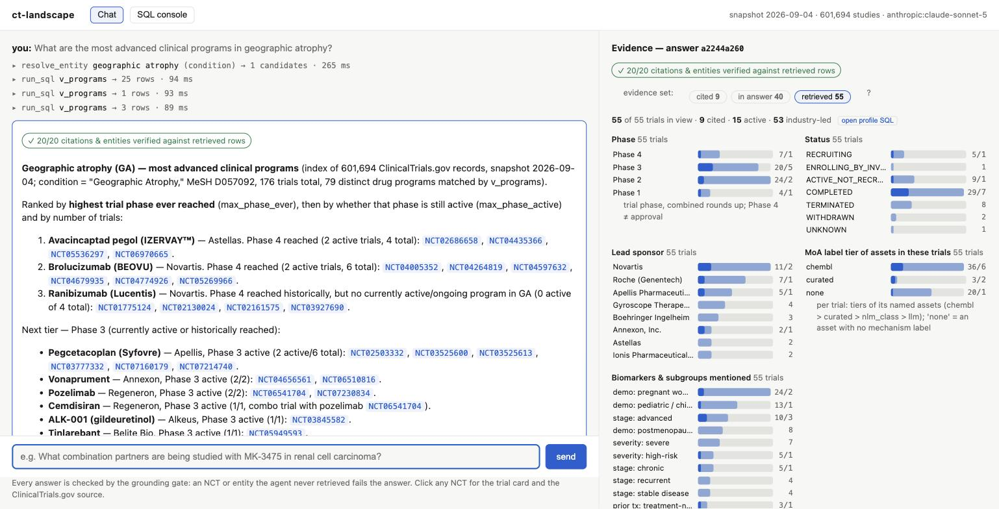

# Clinical Trials Landscape Explorer

A ClinicalTrials.gov landscape-question agent: **one DuckDB index**, a **small tool-using agent** (Pydantic AI, three read-only tools), and a **chat UI whose every answer is machine-verified and traceable** to the trials that support it.

Ask it "what combination partners are being studied with MK-3475 in renal cell carcinoma?" or "what are the most advanced programs in geographic atrophy?" and it resolves the entities against the registry's own vocabularies, writes SQL over definition-of-record views, and returns a cited answer that a fail-closed grounding gate has checked against what was actually retrieved.

Brief: `argon-brief.md` · Design specification: `ct-landscape-agent-design.md` · Build log / resumable checklist: `TASKS.md` · How AI coding agents were used: `PROMPTS.md`.

**Where each deliverable in the brief lives:** source + run instructions → [Getting started](#getting-started) · agent / query interface → the chat UI (`ctl serve`) and `ctl sql`, [What it answers](#what-it-answers) · output experience for inspecting the evidence → [the evidence dashboard](#the-evidence-dashboard) · example questions and answers → [the UI walkthrough](#the-chat-ui) and [example landscape questions](#example-landscape-questions) · indexing / ontology architecture, where it performs well and poorly, precision/recall tradeoffs → [`docs/architecture.md`](docs/architecture.md) · evaluation results and failure modes → [`docs/evaluation.md`](docs/evaluation.md) · use of coding agents → `PROMPTS.md`.

---

## Getting started

Everything runs locally from one checkout: a `uv`-managed Python 3.14 environment, one DuckDB file, one FastAPI process. There are two ways to get an index — the shipped demo slice (one minute, no download) or the full ClinicalTrials.gov corpus (one 2.7 GB download, about ten minutes of build) — and the app is identical on either.

### Prerequisites

- macOS or Linux, `git`, and [`uv`](https://docs.astral.sh/uv/) (it installs Python 3.14 for you if needed):
  ```bash
  curl -LsSf https://astral.sh/uv/install.sh | sh
  ```
- Disk: ~1 GB for the demo path; ~6 GB for the full corpus (2.7 GB zip + 2.7 GB index).
- An Anthropic API key **only** for live chat and live evals. Building, the SQL console, trial cards, the evidence dashboard on recorded answers, and the offline eval replay all work without one.

### 1. Clone and install

```bash
git clone <this repository> ct-landscape && cd ct-landscape
uv sync                       # creates .venv with Python 3.14 and every dependency; nothing is installed globally
uv run pytest                 # optional, ~2 min: ~350 offline tests (no network, no LLM) — confirms the environment
```

Run every command below from the repository root: `.env`, `data/`, `lexicons/` and `runs/` are resolved relative to it.

### 2. Build an index

**Option A — demo slice (recommended first run, ~1 min).** `data/fixtures/demo.zip` (48 MB, 15,484 studies) ships in the repo and contains **every** trial for the six gold-set indications (Erdheim-Chester disease, geographic atrophy, multiple myeloma, IPF, NSCLC, renal cell carcinoma) plus a random sample, so the example questions are complete within it.

```bash
uv run ctl build --demo       # data/fixtures/demo.zip → data/ctg_demo.duckdb (raw → entities → views → mechanism tiers → funnel)
```

**Option B — the full corpus (~10 min on a laptop).**

```bash
uv run ctl fetch              # downloads the site's empty-search "Download → JSON" zip: 2.7 GB, 601,694 per-study files → data/raw/ctg-studies.json.zip
uv run ctl build              # ~70 s ingest + ~6 min normalize (uses cpu_count-1 processes; --workers N to cap) → data/ctg.duckdb (2.7 GB)
```

`ctl fetch` streams from `https://clinicaltrials.gov/api/int/studies/download?format=json.zip` with a progress line; if that endpoint is unavailable, `uv run ctl fetch --pager` crawls the documented v2 API into the same zip layout (slower, same result). The build prints the completeness census and funnel as it goes and loads the shipped mechanism artifacts (`data/enrichment/*.jsonl`, ChEMBL + the LLM pilot) at no cost. `ctl build --skip-ingest` re-runs only normalize + views on an already-ingested database (for lexicon or view edits); `ctl build --limit 20000` builds a pilot from the first N studies.

### 3. Add the API key (for live chat)

```bash
cp .env.example .env          # then set ANTHROPIC_API_KEY=sk-ant-…
```

`.env` is gitignored and is the only secret. The agent runs on `anthropic:claude-sonnet-5`; a typical landscape question costs a few cents with prompt caching.

### 4. Start the app

```bash
uv run ctl serve --demo       # serves data/ctg_demo.duckdb
uv run ctl serve              # serves data/ctg.duckdb (the full build)
# options: --host 0.0.0.0 --port 8080 --db path/to/other.duckdb
```

Open **http://127.0.0.1:8000**. The page has three surfaces: **Chat** (ask a landscape question; the timeline shows each tool call, the badge shows the grounding-gate verdict, the right panel shows the cited trials with live phase/status/sponsor, the evidence dashboard and the full derivation trace), the **evidence dashboard** for any answer, and the **SQL console** (read-only, sandboxed, the same views the agent uses). Every answer gets a permalink (`#/answers/<id>`) and is stored under `runs/answers/`. The server opens the index read-only, so you can rebuild in another terminal while it runs; stop it (`Ctrl-C`) before rebuilding the same file.

Try, in order: *What combination partners are being studied with MK-3475 in renal cell carcinoma?* → *Of those partners, which have a Phase 3 trial that is still active, and who sponsors it?* (a follow-up in the same conversation) → *Is pembrolizumab approved for renal cell carcinoma?* (the answer must refuse to infer approval from trial phase).

### 5. Check that it works without spending anything

```bash
uv run ctl sql "SELECT asset_id, max_phase_active, n_active_trials FROM v_programs WHERE condition_key = 'D002292' ORDER BY 2 DESC NULLS LAST, 3 DESC LIMIT 10" --db data/ctg_demo.duckdb
uv run ctl eval --demo --mode replay --replay-dir runs/evals/live-demo-2     # replays the recorded Sonnet 5 transcripts through the real agent, tools and gate, no model
```

The first prints the most advanced renal-cell-carcinoma programs straight from the definition-of-record view (`--csv` for machine-readable output; omit `--db` to query the full index). The second re-scores the shipped gold set offline by feeding the recorded model turns back through the real tools and the real grounding gate. Recorded transcripts are pinned to the index they were recorded on: against the current index 12 of 14 cases replay identically and two diverge **because the index got stricter** after the recording — G07's recorded answer names cabozantinib as a pembrolizumab partner (now excluded as a backbone pair) and G05b's names the code RMC-9805 (now folded into zoldonrasib) — so the gate rejects those two recorded answers and the run reports them as replay mismatches. That is the fail-closed gate doing its job, not a regression; `uv run ctl eval --demo --mode live` (~$4) re-records all 14 against the current index.

### Optional: refresh the mechanism tiers

```bash
uv run ctl enrich chembl                  # re-derive the ChEMBL tier live from the EMBL-EBI REST API ($0, a few minutes; the raw pull is cached in data/enrichment/chembl_raw.json)
uv run ctl enrich llm --dry-run           # plan the LLM tier: how many assets, estimated cost; nothing is sent
uv run ctl enrich llm --limit 300         # the pilot actually run for this write-up ($0.21); the full tail is ~$22 under a $35 ceiling
```

### Troubleshooting

- **`ANTHROPIC_API_KEY` not found** — the key is read from `.env` in the current directory; run from the repository root, or export the variable in the shell.
- **`Could not set lock on file` / database is locked** — one writer at a time: stop a running `ctl build`/`ctl enrich` before starting another on the same file. `ctl serve` and `ctl sql` open read-only and coexist with each other.
- **Port 8000 in use** — `uv run ctl serve --demo --port 8080`.
- **Build is slow or memory-bound** — `--workers 4` caps the parser processes; the full normalize step needs ~4 GB of RAM.
- **`ctl fetch` stalls** — the download is a single 2.7 GB stream with a 10-minute read timeout; re-run it (it restarts from scratch), or use `--pager`.
- **Wrong index served** — `ctl serve` defaults to `data/ctg.duckdb`; use `--demo` (or `--db`) if you only built the demo. The header of the page shows the snapshot date and study count of whatever it is serving.

`ctl` is the ops surface (`fetch / build / enrich / serve / eval / sql`); the product interface is the web app.

---

## What it answers

| # | Question archetype | Definition of record (a named SQL view) |
|---|---|---|
| Q1 | Drugs in development for indication X | `v_programs` — one row per (asset, condition): trials, active trials, max phase ever / active, full NCT list |
| Q2 | Most advanced programs in X | `v_programs.max_phase_active` (trial-derived, capped at Phase 3 semantically — never an approval claim) |
| Q3 | Most active companies in area Y | `v_sponsor_activity` — lead sponsor × therapeutic area; industry-only, ranked by active trials by default |
| Q4 | MoA / targets under investigation in X | `v_moa` (provenance-labeled waterfall: `chembl` > `curated` > `nlm_class` > `llm`) ⋈ `v_programs` |
| Q5 | Trials studying mechanism M | `v_moa_trials` — mechanism key → assets → trials, by condition |
| Q6 | Biomarkers / patient subgroups targeted | `v_population_landscape` — typed lexicon mentions (biomarker · demographic · severity · prior therapy · line · stage) |
| Q7 | Combination partners of asset / mechanism Z | `v_combo_partners` — co-administration in one experimental arm (`arm`) or a combination-named product (`name`); pairs that are both present in every arm (the backbone) are excluded, same-mechanism pairs are flagged |

The agent has exactly three tools — `resolve_entity` (a deterministic ladder, never fuzzy), `run_sql` (a four-layer read-only sandbox over these views), `get_trial` (one trial card) — and one way to finish: the `submit_answer` structured output. A **fail-closed grounding gate** runs as the output validator: every NCT id and every entity in the answer must have appeared in a tool result during the conversation, or the answer is rejected and the model gets one retry. The UI shows the gate's verdict as a badge the model cannot forge, renders citations with phase/status/sponsor pulled live from the index, links every NCT to its trial card and to clinicaltrials.gov, and exposes the full derivation trace (every SQL statement, row counts, timings) behind a permalink.

How the index is built, what the views mean and where the system is strong or weak is in [`docs/architecture.md`](docs/architecture.md).

---

## The chat UI


Left: the derivation timeline (`resolve_entity` MK-3475 → pembrolizumab; `run_sql` over `v_combo_partners`), the machine-verified gate badge, and the structured table with every NCT auto-linked. Right: the citations with phase, status and sponsor pulled live from the index, the entity list, and the expandable trace (each SQL statement, row counts, timings, coverage footer). Answered in 4 model turns, ~30 s, with prompt caching.


The same conversation one turn later. "Of those partners" resolves against the previous turn's retrieved rows (the answer's footer says `context includes turns 1–1`); the timeline shows the agent's first SQL failing on a column the view does not have and the corrected query succeeding — errors are tool results, not retries — then six `get_trial` cards feeding a table whose sponsor column separates industry leads (Merck, Eisai) from cooperative groups (Alliance, SWOG). The caveats state the house definition of "active", that sponsor ≠ owner, and that absence in this snapshot is not absence everywhere. 8 steps, 31 s, gate 17/17.

### The evidence dashboard


Every answer has three nested evidence sets: **cited** (`citations[]`), **in answer** (every NCT in the prose or table) and **retrieved** (every NCT that appeared in any tool result this conversation, i.e. the grounding gate's set). The right-hand panel profiles the chosen set straight from the index (`POST /api/trials/profile`), never from model text: phase, status, lead sponsor, start year, the MoA-label tier of the assets in each trial, and the **biomarkers and patient subgroups** its eligibility text mentions (lexicon-based, so recall-limited, and inclusion vs exclusion is not parsed — the chart says so), with the cited trials drawn as the darker segment of every bar. A **lead sponsor × phase matrix** sits under the bars; a cell sets both filters at once. Bars and cells cross-filter each other and the trial list, so "what did the agent see but not cite?" and "which of these are Phase 3 and recruiting?" are one click, with no model in the loop.

Three more figures close the loop between the answer and the index:

- **The answer table as a figure.** A ranked table with a numeric column is drawn as a bar chart from `table.rows` (never parsed from prose). Clicking a bar highlights the row and filters the evidence to the row's listed NCTs plus every evidence-set trial naming an asset whose id equals a cell verbatim. When that count differs from the row's own number (18 trials name lenvatinib; 17 pair it with pembrolizumab in one arm), the difference is a real difference in definition, shown rather than hidden.
- **Reference check: the agent's table against the definition of record.** For each condition / drug / company the answer named, the index returns its definition-of-record rows (`v_programs` per asset for a condition, per condition for a drug; `v_sponsor_condition` for a company) keyed by exact id and exact canonical name. Every answer-table row whose cell equals a key verbatim gets the index's numbers laid beside the agent's (trials, active trials, max phase ever / active, lead company of the most advanced trial). A like-kind equality is underlined; a difference is shown, not judged — on the RCC combination question the agent's 17 lenvatinib trials are arm-level pairings with pembrolizumab, the index's 37 are every lenvatinib program trial in RCC, and both are correct under their own column header. No fuzzy matching: unmatched rows are omitted and counted.
- **Entity landscapes.** The same cards also show headline counts, programs by most-advanced active phase, most active lead sponsors, MoA-label coverage by tier (the completeness the §7.3 house rule asks the agent to state), biomarkers and subgroups, trials by start year, and a sponsor × phase (or condition × phase) matrix. Each figure carries a **SQL** button that drops its exact query into the SQL console, so a reviewer can re-run any number on the screen.

The coverage footer in the trace panel is drawn the same way, so an answer's completeness claims sit next to the index's own completeness.

---

### Two more questions from the gold set


"What drugs are in development for idiopathic pulmonary fibrosis?" The answer states how many programs exist, how many are currently active, and the phase distribution before ranking, so the reader knows what the table is a slice of. The evidence panel shows that most retrieved trials carry no mechanism label (the head-heavy coverage described in the architecture notes) rather than hiding it.



"What are the most advanced clinical programs in geographic atrophy?" Three tool calls, then a ranking that distinguishes *phase ever reached* from *phase still active* (ranibizumab reached Phase 4 historically but has no active program), with every NCT linked. The caveat the agent must state, that a Phase 4 trial is not evidence of approval, is part of the gold case.

---

## Example landscape questions

These run with zero LLM spend, straight from the views via `ctl sql` or the SQL console.

They are the queries the agent writes; the chat UI adds the prose, the gate, and the evidence panel.

**Q1/Q2 — most advanced programs in renal cell carcinoma (D002292)**

| asset | max phase (active) | trials | active trials |
|---|---|---|---|
| nivolumab | 4 | 130 | 70 |
| cabozantinib | 4 | 57 | 46 |
| pembrolizumab | 3 | 125 | 68 |
| ipilimumab | 3 (ever 4) | 63 | 43 |
| lenvatinib | 3 (ever 4) | 37 | 29 |
| axitinib | 3 | 54 | 26 |
| belzutifan | 3 | 22 | 22 |

Caveat the agent must state: a Phase 4 trial is not evidence of approval; trial-derived stage caps at Phase 3.

**Q1 — Erdheim-Chester disease (D031249)**: 15 programs over 22 trials, hand-verifiable — trametinib + dabrafenib (Phase 3 NCT07440290), vemurafenib + cobimetinib (Phase 3 NCT05768178), cobimetinib (NCT04079179), lenalidomide, tocilizumab, HLX208, HH2710, … The gold set for this question (G01) was adjudicated from the raw records: six drugs have an active trial today.

**Q3 — most active industry lead sponsors in Oncology** (ranked by active trials, total as tiebreak): AstraZeneca 282/678 · Merck & Co. (MSD) 240/519 · Bristol Myers Squibb 164/711 (Celgene folded in) · Roche (Genentech) 149/796 · Johnson & Johnson (Janssen) 146/340 · Pfizer 114/633 · Novartis 112/781.

**Q7 — combination partners of MK-3475 in RCC**: `MK-3475` resolves via alias to `pembrolizumab`; partners (arm-level co-administration in an experimental arm, or a combination-named product; pairs that are both present in every arm excluded): lenvatinib 12 trials · belzutifan 8 · axitinib 7 · quavonlimab 4 · cyclophosphamide 3 · atezolizumab 3 · … plus nivolumab 7 flagged `same_mechanism` (arms listing "anti-PD-1 of investigator's choice"), which the agent is told to report separately. Before the backbone rule, nivolumab ranked second with 11 trials — a comparator-arm artefact. Class-level partners ("+ chemotherapy") are gated out before assets exist — a disclosed limitation.

**Q6 — biomarkers in NSCLC (D002289)**: EGFR 2,131 trials · PD-L1 1,082 · ROS1 506 · ALK 477 · BRAF 314 · KRAS 311 · EGFR T790M 258 · NTRK 140. (LVEF and HBV DNA also rank high: they are eligibility thresholds, not targets — the agent is told to verify top hits by reading eligibility before asserting a population is *targeted*.)

**Messiness probe — "Is docetaxel in development for NSCLC?"**: 265 trials as subject, 87 as comparator, 66 unknown-role; the answer must separate them.

---

## Documentation

- [`docs/architecture.md`](docs/architecture.md) — the pipeline, the ontology (raw → entities → views), the mechanism waterfall, design choices the brief left open, the completeness funnel from the full-corpus build, where it performs well and poorly, the precision/recall dials, and the repository layout.
- [`docs/evaluation.md`](docs/evaluation.md) — how accuracy and completeness are verified (index, query and agent level), live eval results, the LLM mechanism-tier pilot, gold-set status, and every failure mode found so far.
- [`docs/llm_pilot_review.md`](docs/llm_pilot_review.md) — the hand-check sheet for the LLM mechanism tier.
- `ct-landscape-agent-design.md` — the full design specification; `TASKS.md` — build checklist and recorded deviations; `PROMPTS.md` — how AI coding agents were used.

ChEMBL data © EMBL-EBI, licensed CC BY-SA 3.0; the derived `data/enrichment/chembl_moa.jsonl` is share-alike. ClinicalTrials.gov is the sole source of truth for trials, assets, sponsors and conditions.
